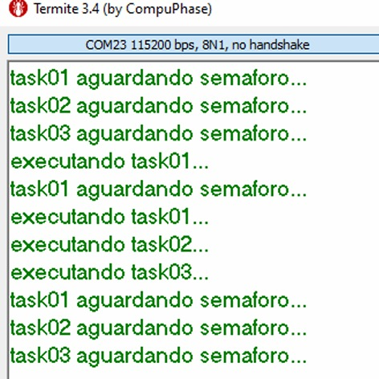

# Exercício 02 - Liberação de Semáforo via Interrupção

## Observação de Comportamento

R: Desta vez, montei um cenário semelhante ao anterior, com diferença que coloquei uma depuração antes de cada task tentar dar acquire no semáforo. Então no início, as três irão printar que estão aguardando o semáforo, quando eu libero apenas 1 unidade do semáforo, ele executa a task01 (de maior prioridade) e ela volta a aguardar o semáforo novamente, passando na frente das tasks 02 e 03. Porém, se eu liberar semáforos suficientes para todos, as três executarão na ordem, e depois, voltarão a aguardar por um semáforo. (obs.: cada task tem um osDelay(1000)).

## Hardware
- Microcontrolador: STM32F446RE
- Placa: NUCLEO-F446RE
- Periféricos utilizados: GPIO, UART, EXTI

## Imagens

