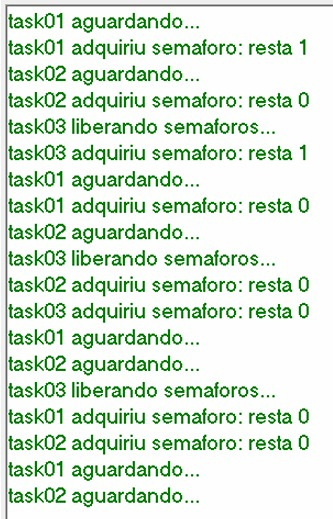

# Exercício 03 - Teste de Disponibilidade e Liberação Manual de Semáforo

## Observação de Comportamento

R: Da forma que implementei, fiz com que as tasks 01 e 02 apenas adquirissem o semáforo (que começa cheio) e a task 3 enchesse ele denovo e adquirisse uma vez. O ciclo se mantém, circulando entre acquires e tasks 01 e 02 esperando pela liberação. Porém, devido a task que libera não ser a que pegou o semáforo, devido a preempção, no último ciclo, a task 03 enche o contador, mas é preemptada pela task 01, assim quebrando o ciclo e gerando um deadlock, onde o contador está vazio, e as tasks 01 e 02 aguardam pelo semáforo.

O que mudaria com o mutex? No mutex ou semáforo de exclusão mútua, não é possível que outra tarefa que não é "dona" do mutex dê release nele e nem que outra tarefa "roube" a vez no semáforo. Logo, busca-se garantir a não-preempção de tarefas, e evitar deadlocks como este.

## Hardware
- Microcontrolador: STM32F446RE
- Placa: NUCLEO-F446RE
- Periféricos utilizados: GPIO, UART

## Imagens

