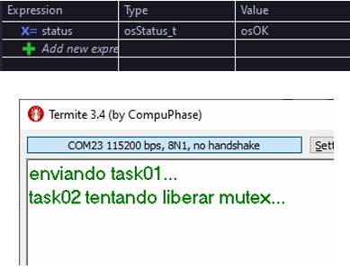

# Exercício 04 - Tentativa Indevida de Liberação de Mutex

## Observação de Comportamento

R: Como é uma questão simples, fiz conforme o enunciado pede e coloquei a task01 para dar acquire no Mutex e não liberá-lo, e a task02 para tentar dar release, o que não deu certo, pois a própria implementação do mutex impede isso e o sistema todo trava no momento em que essa liberação é solicitada.

Perceba que nem pelo Debug é possível ver a alteração do valor da variável, a função de release não chega nem a retornar o valor osErrorResource e armazená-lo na variável de status.

## Hardware
- Microcontrolador: STM32F446RE
- Placa: NUCLEO-F446RE
- Periféricos utilizados: GPIO, UART

## Imagens

