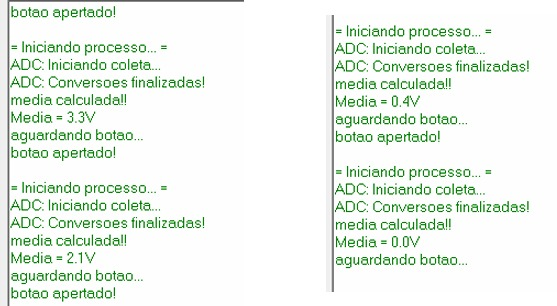

# Exercício 06 - Sincronização Completa por Evento Externo com Armazenamento e Transmissão de Dados

## Observação de Comportamento

R: Implementei o sistema em cadeia, onde nada ocorre inicialmente até que o botão seja apertado, também fiz uma técnica de debouncing utilizando uma flag variável processo_ativo que só é abaixada quando o processo é finalizado, então mesmo que o botão seja pressionado diversas vezes, uma nova conversão só será feita caso ele seja apertado depois que a mensagem "aguardando botao" for exibida.

Perceba que os valores lidos são em volts, retirados de um potenciômetro e convertidos para volts. Uma das dificuldades encontradas nesse e no exercício anterior foi de exibir valores double no terminal, pois a memória da taskSend não era suficiente para tal. Quando descobri o problema graças a minha dupla Pablo Daniel, pude resolver o problema aumentando a memória da mesma.

## Hardware
- Microcontrolador: STM32F446RE
- Placa: NUCLEO-F446RE
- Periféricos utilizados: GPIO, UART3, ADC, EXTI

## Imagens

